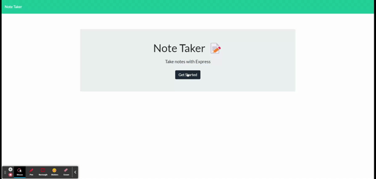

  
# Note-taker

## Description
This project is showing the ability to populate, read, and write text with express.js. Once installed, run the application by typing `node index.js` in the terminal within the directory of the install.  You will then need to run this in your browser at `localhost:3001`.  You may also follow the Heroku link below to run this application without node installed on your system.  My motivation for this project was to show the capabilities of writing routes through a local host and displaying the information on a front end application.
This project helps the user make a list of notes that will be persistent in the application.  This also shows the capabilities of using existing code to connect back-end javascript functions.

# Table of Contents
- [Installation](#Installation)
- [Description](#Description)
- [Usage](#Usage)
- [What-I-learned](#What-I-Learned)
- [Screenshot-of-Application](#Screenshot-of-Application)
- [Links](#Links)
- [Questions?](#Questions?)
- [License](#License)

## Installation
In order to install this project you will need to by clone from git hub using `git clone` plus the url of the repository.  Make sure you have node installed on your computer, and then type `npm i` within the directory of the cloned repository from github.

## Usage
This Project is used for showing the ability to populate, read, and write text with express.js.

## What-I-Learned
To make this Project work, clone from git hub using `git clone` plus the url of the repository.  Make sure you have node installed on your computer, and then type `npm i` within the directory of the cloned repository from github.  I learned how to modularize the data across multiple files within a directory using JavaScript.  I also exercised my ability to write code for back end functions based off of user input.  I realized the significance of middle-ware functions within express.js, and learned to work with errors in a new format through the terminal.
Email issues to byrdbass@gmail.com

I did not get the delete portion of the application running with this code.  Feedback is appreciated!

    app.delete('api/notes/:id', (req, res) => {
      const id = req.params.id;
      res.unlink(id, './db/db.json')
      res.readFile(id, './db/db.json')
    });

## Screenshot of Application

## Links
[Heroku Deployed application](https://write-some-notes.herokuapp.com/)

[github repository](https://github.com/Byrdbass/note-taker)

## Questions?
My gitHub user name is byrdbass, and you may email me at byrdbass@gmail.com for Questions.

## License
MIT
